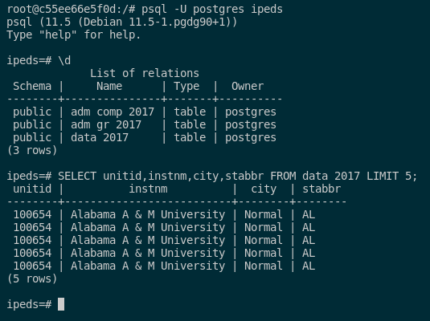
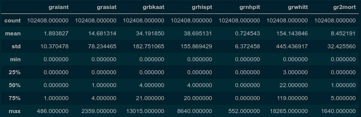

# IPEDS Pipeline Library

## Motivation

Institutions of higher education stand as beacons of progressive thought and social change. Yet, our society still struggles to realize equity in the courtroom, in the workplace, and in the classroom. Education is touted as the great equalizer that opens doors for the oppressed. If this is true, then equity in education must be a top priority for creating positive social change. It is necessary to examine how our institutions of education, from pre-K to post-secondary, are facilitating (or preventing) the path toward this ideal. 

The motivating goal of this capstone project is to answer essential questions about how equitable our higher education system is in its current state: 

1. Is there a significant difference in post-secondary graduation rates,
outcomes, and degrees awarded for Pell Grant/Subsidized Stafford Loan
(SSL) recipients and/or minority students compared to students outside
these groups?

2. Is there a state-by-state variance in these metrics?

3. Does this disparity persist when one accounts for variable levels in
college preparedness between these groups?

Before one can answer these questions, it is necessary to obtain data usable for answering these questions. The primary goal of this capstone is to create a publicly usable dataset with which to answer these questions. The secondary goal was to create exploratory graphs and tables which would guide futher analysis.

## The IPEDS dataset

The National Center for Education Statistics, part of the US Department of Education, has a publicly available central repository for postsecondary education data: the [Integrated Postsecondary Education Data System (IPEDS)](https://nces.ed.gov/ipeds/). Data contained in the data system are aggregate data reported by over 7000 US postsecondary institutions reported annually in three reporting periods. 

At the time of this capstone project, the data in Table 1 were publicly available from the IPEDS database. 

The data from these tables can be downloaded in CSV for all collection years listed. Beginning with the 2006-07 collection year, annual collections were also compiled into an MS Access database. Unfortunately, data are not available in other database formats (e.g. Oracle, Postgres, and MongoDB). This fact motivated me to create a "goal zero" for the project: to create a publicly usable python library that others could utilize to customize IPEDS data to fit their research needs.

## The IPEDS python library

The product produced for this capstone is a python library with three primary functions. Each of the three classes in this object-oriented library addresses one of these primary functions: 

* [IpedsTable](IpedsTable.md) - cleaning and manipulating individual IPEDS tables
* [IpedsCollection](IpedsCollection.md) - aggregating multiple IPEDS tables for pipeline cleaning and merging into a single table
* [IpedsDatabase](IpedsDatabase.md) - Writing tables to a database 

The IPEDS python library utilizes Pandas DataFrames for storing tabular data. The [SQLAlchemy](https://www.sqlalchemy.org/) library is used for connections to databases. Only Postgres databases are currently supported by the library, but SQLAlchemy also supports SQLite, MySQL, Oracle, MS-SQL, Firebird, Sybase and others. Future releases of the IPEDS python library could potentially support these flavors as well.

## Pipelines with the IPEDS python library

The IPEDS python library was designed with merging a collection of tables in mind. The IpedsCollection class facilitates this by allowing the user to add each table individually to a collection, specifiying the columns to be kept or dropped. The user can also choose which imputation codes should be purged from the table with the help of a fourth class in the library (<LINK> ImputationTypes).

The primary goal of this capstone is to create a single dataset which would allow one to answer questions about admissions, graduation rates, and outcomes for students of color and low socioeconomic status compared to their peers. To this end, I constructed a pipeline with the IPEDS python library which would merge the following tables and columns into  a single table, then export the table to a Postgres database.

### Tables included
Below is the list of tables and columns selected for inclusion in my dataset. Each table was pulled for the 2017 reporting year.

* **HD_2017** 
    contains institution identifying information such as name, address, city, state, zip, and Carnegie classification.  It also contains an indicator that the school participates in Title IV federal financial aid programs. Below is a table of colums pulled from this table.
    
    | Column Name | Description |
    |-------------|-------------|
    | UNITID | unique institution ID |
    | INSTNM | Institution Name |
    | CITY | city |
    | STABBR | state abbreviation |
    | ICLEVEL | level category (4-yr, 2-yr, <2-yr) |
    | CONTROL | institutional control (public, private not-for-profit, private for-profit) |
    | HLOFFER | highest level offered  |
    | HBCU | code to indicate an HBCU institution |
    | TRIBAL | code to indicate a tribal institution |
    | LOCALE | "large city" to "rural" |
    | INSTSIZE | category based on total enrollment |
    | LONGITUD | longitude of the institution |
    | LATITUDE | latitude of the institution |

* **ADM_2017** contains dmissions-related information such as admissions considerations, applicants, admitted applicants, applicants who enrolled, and SAT/ACT test data (if applicable).

    | Column Name | Description |
    |-------------|-------------|
    | UNITID | unique institution ID |
    | ADMCON1 | secondary school GPA |
    | ADMCON2 | secondary school rank |
    | ADMCON3 | secondary school record |
    | ADMCON4 | completion of college-prep program |
    | ADMCON5 | recommendations |
    | ADMCON6 | portfolios, certificates of mastery, assessment instruments |
    | ADMCON7 | ACT/SAT scores |
    | ADMCON8 | TOEFL (Test of English as a Foreign Language) |
    | ADMCON9 | Other standardized tests (Wonderlic, WISC-III) |
    | APPLCN | total number of applicants |
    | ADMSSN | total number of admissions |
    | ENRLT | total enrollment |
    | ENRLFT | full-time enrollment |
    | ENRLPT | part-time enrollment |
    | SATVR25 | SAT verbal 25th percentile |
    | SATVR75 | SAT verbal 75th percentile |
    | SATMT25 | SAT math 25th percentile |
    | SATMT75 | SAT math 75th percentile |
    | ACTEN25 | ACT english 25th percentile |
    | ACTEN75 | ACT english 75th percentile |
    | ACTMT25 | ACT math 25th percentile |
    | ACTMT75 | ACT math 75th percentile|

* **C_2017** contains number of awards by type of program, level, first/second major and race/ethnicity and gender. Data cover degrees awarded between July 1, 2016 to June 30, 2017. Each record contains the total awards, awards for men and women, and total awardds for men and women across nine racial/ethnicity categories.
    
    | Column Name | Description |
    |-------------|-------------|
    | UNITID | unique institution ID |
    | AWLEVELC | award level code |
    | CSTOTLT | All races total |
    | CAIANT | American Indian/Alaska Native total |
    | CASIAT | Asian total |
    | CBKAAT | Black or African American total |
    | CHISPT | Hispanic or Latino total | 
    | CNHPIT | Native Hawaiian/Pacific Islander total |
    | CWHITT | White total |
    | C2MORT | Two or more races total |

* **GR_2017** contains graduation rates for the cohort of full-time, first-degree/certificate-seeking stidemts within 100%, 150%, 200% normal time. Cohorts are broken down by race/ethnicity and gender.
    
    | Column Name | Description |
    |-------------|-------------|
    | UNITID | unique institution ID |
    | CHRTSTAT | code indicating completion status by program type |
    | COHORT | cohort of program type |
    | GRAIANT | American Indian/Alaska Native total |
    | GRASIAT | Asian total |
    | GRBKAAT | Black or African American total |
    | GRHISPT | Hispanic or Latino total |
    | GRNHPIT | Native Hawaiian/Pacific Islander total |
    | GRWHITT | White total |
    | GR2MORT | Two or more races total |

* **GR_PELL_SSL_2017** contains gaduation rates for three subcohorts: Pell Grant recipients, Subsidized Stafford Loan (without Pell Grant), and non PG/SSL recipients. 

    | Column Name | Description |
    |-------------|-------------|
    | UNITID | unique institution ID |
    | PSGRTYPE | subgroup: 4-yr degree+cert, 4-yr degree, 4-yr cert, <=2-yr degree+cert |
    | PGADJCT | Pell Grant recipients - count adjusted for exclusions |
    | PGCMTOT | Pell Grant recipients - completed within 150% time | 
    | SSADJCT | Subsidized Stafford Loan (w/o Pell Grant) recipients - count adjusted for exclusions |
    | SSCMTOT |  Subsidized Stafford Loan (w/o Pell Grant) recipients - completed within 150% time | 
    | NRADJCT | Non-recipients - count adjusted for exclusions |
    | NRCMTOT | Non-recipients - completed within 150% time |

### Imputation Values Purged
In each of the tables, the following imputation values were purged. Rows which contained all of these imputation values in the kept columns were dropped.

| Attribute | Code |
|-----------|-------------|
| data_not_usable | H |
| do_not_know | D |
| left_blank | B |
| not_applicable | A |

### Pipeline flow
The following is the process used in the pipeline to create a single merged table for export to a file and database. Code for this pipeline can be found in [src/demo_pipeline.py](src/demo_pipeline.py). 

## Results and Challenges
Below is the number of records in each table before and after cleaning with the pipeline:

| table | Count before | Count after | Memory before | Memory after |
|-------|--------------|-------------|---------------|--------------|
| HD_2017  | 7153  |  7153  |   3.9 MB  |   0.764 MB  |  
| ADM_2017 | 2075  |  939   |    1.1 MB  |  0.186 MB  |
| C_2017  | 308954    | 308943   | 150.9 MB | 25.9 MB |
| GR_2017  | 54714  |  49981   |  27.6 MB | 4.2 MB | 
| GR_PELL_SSL_2017 | 9116 | 9116 | 3.5 MB | 0.626 MB | 

The merged table has the following characteristics: 

| number of rows | Memory used | CSV filesize | 
|--------------|----------------|--------------|
| 7065710   | 3.3 GB | 1941 MB | 

An immediate question comes to mind: why is the merged table so much bigger than the sum of the initial tables? It turns out that both the outcomes table (C_2017) and the graduation rates table (GR_2017) contain multiple columns for each institution. 

Note that tables were note purged of null values that did not meet the exclude imputations criteria. This decision resulted in the following null value counts: 

| column(s) | number of null values |
|-----------|-----------------------|
| graduation counts by race/ethnicity ['graiant','grasiat', etc.] | 3574 |
| 'admssn' (number of students admitted) | 1152 |
| 'enrlt' (number of students enrolled) | 1306 |
| 'enrlft' (students enrolled full time) | 3150 |
| 'enrlpt' (students enrolled part time) | 756860 |
| SAT score data ['satvr25','satvr75',etc.] | 1123023 |
| ACT score data ['acten25','acten75',etc.] | 1372683 |

Dropping these records would reduce the size of the data table by 20-40% and could bias the data against schools that have open enrollment policies. 

Unfortunately I was unable to write the entire table to the database due to memory issues on my laptop. However, it would be possible to write to the database in chunks to free up memory that is already written. Nonetheless, the Ipeds Library is able to successfully write data to a Postgres database:

Note that despite cleaning the data, null values reappear in the merged tables because not all schools have students in each reporting cohort. For example, IPEDS non-Title IV schools (i.e. those receiving federal student financial aid) would appear in the graduation rate table, but not the Pell Grant/Stafford Subsidized Loan table when an outer join is performed during the merge. 

Much of the time and energy dedicated to this capstone was put into producing a publicly usable library. Unfortunately this took longer than the time allotted for the project. Nonetheless, I was able to produce some exploratory figures and plots:

### 2017 graduation rates statistics

### 2017 cohort counts
| Cohort | count | 
|--------|-------|
| Bachelor's/ equiv +  other degree/certif-seeking 2011 subcohorts (4-yr institution) | 24823 |
| Bachelor's or equiv 2011  subcohort (4-yr institution) | 46647 |
| Other degree/certif-seeking 2011 subcohort (4-yr institution) | 18146 |
| Degree/certif-seeking students 2014 cohort ( 2-yr institution) | 17725 |

## Conlcusion and Future Work
The result of this project is a publicly available library of four python classes which can manipulate tablular data from the IPEDS data center. The classes allow their user to create a pipeline with a minimal knowledge of python. A pipeline was created on selected tables from the database to be merged into a single table. Memory constraints prevented a single table from being written; two separate tables were created instead.

The next improvement to the library I would make is to include methods in the IpedsTable library that would allow a user to create a class that produces exploratory graphs and tables without the need know how to code in python. 

To further this end of separating the user from needing to know python, it would be beneficial for the pipeline python code to parse arguments at runtime. These arguments would point to a pipeline setup file which would require only a formatted text file. 
