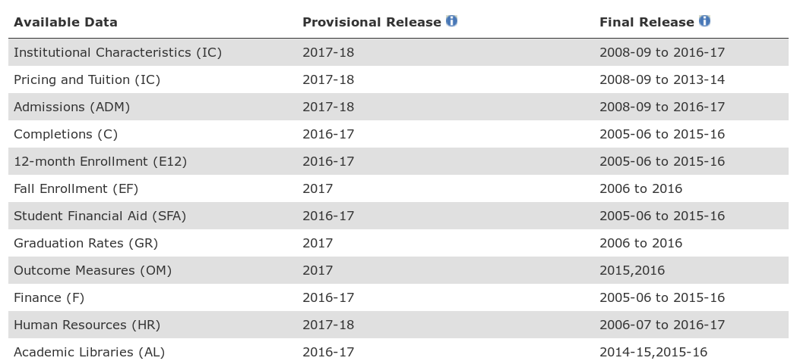
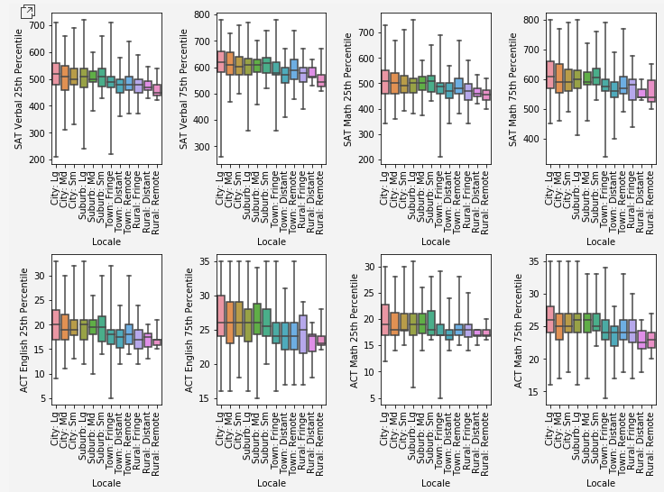

# IPEDS Pipeline Library

## Motivation

Institutions of higher education stand as beacons of progressive thought and social change. Yet, our society still struggles to realize equity in the courtroom, in the workplace, and in the classroom. Education is touted as the great equalizer that opens doors for the oppressed. If this is true, then equity in education must be a top priority for creating positive social change. It is necessary to examine how our institutions of education, from pre-K to post-secondary, are facilitating (or preventing) the path toward this ideal. 

The motivating goal of this capstone project is to answer essential questions about how equitable our higher education system is in its current state: 

1. Is there a significant difference in post-secondary graduation rates, outcomes, and degrees awarded for Pell Grant/Subsidized Stafford Loan (SSL) recipients and/or minority students compared to students outside these groups?

2. Is there a state-by-state variance in these metrics?

3. Does this disparity persist when one accounts for variable levels in college preparedness between these groups?

Before one can answer these questions, it is necessary to obtain data usable for answering these questions. The primary goal of this capstone is to create a publicly usable dataset with which to answer these questions. The secondary goal was to create exploratory graphs and tables which would guide futher analysis.

## The IPEDS dataset

The National Center for Education Statistics, part of the US Department of Education, has a publicly available central repository for postsecondary education data: the [Integrated Postsecondary Education Data System (IPEDS)](https://nces.ed.gov/ipeds/). Data contained in the data system are aggregate data reported by over 7000 US postsecondary institutions reported annually in three reporting periods. 

At the time of this capstone project, the data in Table 1 were publicly available from the IPEDS database. 

The data from these tables can be downloaded in CSV for all collection years listed. Beginning with the 2006-07 collection year, annual collections were also compiled into an MS Access database. Unfortunately, data are not available in other database formats (e.g. Oracle, Postgres, and MongoDB). This fact motivated me to create a "goal zero" for the project: to create a publicly usable python library that others could utilize to customize IPEDS data to fit their research needs.

## The IPEDS python library

The product produced for this capstone is a python library with three primary functions. Each of the three classes in this object-oriented library addresses one of these primary functions: 

* [IpedsTable](IpedsTable.md) - cleaning and manipulating individual IPEDS tables
* [IpedsCollection](IpedsCollection.md) - aggregating multiple IPEDS tables for pipeline cleaning and merging into a single table
* [IpedsDatabase](IpedsDatabase.md) - Writing tables to a database 

The IPEDS python library utilizes Pandas DataFrames for storing tabular data. The [SQLAlchemy](https://www.sqlalchemy.org/) library is used for connections to databases. Only Postgres databases are currently supported by the library, but SQLAlchemy also supports SQLite, MySQL, Oracle, MS-SQL, Firebird, Sybase and others. Future releases of the IPEDS python library could potentially support these flavors as well.

## Pipelines with the IPEDS python library

The IPEDS python library was designed with merging a collection of tables in mind. The IpedsCollection class facilitates this by allowing the user to add each table individually to a collection, specifiying the columns to be kept or dropped. The user can also choose which imputation codes should be purged from the table with the help of a fourth class in the library (<LINK> ImputationTypes).

The primary goal of this capstone is to create a single dataset which would allow one to answer questions about admissions, graduation rates, and outcomes for students of color and low socioeconomic status compared to their peers. To this end, I constructed a pipeline with the IPEDS python library which would merge the following tables and columns into  a single table, then export the table to a Postgres database.

### Tables included
Below is the list of tables and columns selected for inclusion in my dataset. Each table was pulled for the 2017 reporting year.

* **HD_2017** 
    contains institution identifying information such as name, address, city, state, zip, and Carnegie classification.  It also contains an indicator that the school participates in Title IV federal financial aid programs. Below is a table of colums pulled from this table.
    
    | Column Name | Description |
    |-------------|-------------|
    | UNITID | unique institution ID |
    | INSTNM | Institution Name |
    | CITY | city |
    | STABBR | state abbreviation |
    | ICLEVEL | level category (4-yr, 2-yr, <2-yr) |
    | CONTROL | institutional control (public, private not-for-profit, private for-profit) |
    | HLOFFER | highest level offered  |
    | HBCU | code to indicate an HBCU institution |
    | TRIBAL | code to indicate a tribal institution |
    | LOCALE | "large city" to "rural" |
    | INSTSIZE | category based on total enrollment |
    | LONGITUD | longitude of the institution |
    | LATITUDE | latitude of the institution |

* **ADM_2017** contains dmissions-related information such as admissions considerations, applicants, admitted applicants, applicants who enrolled, and SAT/ACT test data (if applicable).

    | Column Name | Description |
    |-------------|-------------|
    | UNITID | unique institution ID |
    | ADMCON1 | secondary school GPA |
    | ADMCON2 | secondary school rank |
    | ADMCON3 | secondary school record |
    | ADMCON4 | completion of college-prep program |
    | ADMCON5 | recommendations |
    | ADMCON6 | portfolios, certificates of mastery, assessment instruments |
    | ADMCON7 | ACT/SAT scores |
    | ADMCON8 | TOEFL (Test of English as a Foreign Language) |
    | ADMCON9 | Other standardized tests (Wonderlic, WISC-III) |
    | APPLCN | total number of applicants |
    | ADMSSN | total number of admissions |
    | ENRLT | total enrollment |
    | ENRLFT | full-time enrollment |
    | ENRLPT | part-time enrollment |
    | SATVR25 | SAT verbal 25th percentile |
    | SATVR75 | SAT verbal 75th percentile |
    | SATMT25 | SAT math 25th percentile |
    | SATMT75 | SAT math 75th percentile |
    | ACTEN25 | ACT english 25th percentile |
    | ACTEN75 | ACT english 75th percentile |
    | ACTMT25 | ACT math 25th percentile |
    | ACTMT75 | ACT math 75th percentile|

* **C_2017** contains number of awards by level, race/ethnicity and gender. Data cover degrees awarded between July 1, 2016 to June 30, 2017. Each record contains the total awards for men and women across nine racial/ethnicity categories.
    
    | Column Name | Description |
    |-------------|-------------|
    | UNITID | unique institution ID |
    | AWLEVELC | award level code |
    | CSTOTLT | All races total |
    | CAIANT | American Indian/Alaska Native total |
    | CASIAT | Asian total |
    | CBKAAT | Black or African American total |
    | CHISPT | Hispanic or Latino total | 
    | CNHPIT | Native Hawaiian/Pacific Islander total |
    | CWHITT | White total |
    | C2MORT | Two or more races total |

* **GR_2017** contains graduation rates for the cohort of full-time, first-degree/certificate-seeking stidemts within 100% and 150% normal time. Cohorts are broken down by race/ethnicity and gender.
    
    | Column Name | Description |
    |-------------|-------------|
    | UNITID | unique institution ID |
    | CHRTSTAT | code indicating completion status by program type |
    | COHORT | cohort of program type |
    | GRAIANT | American Indian/Alaska Native total |
    | GRASIAT | Asian total |
    | GRBKAAT | Black or African American total |
    | GRHISPT | Hispanic or Latino total |
    | GRNHPIT | Native Hawaiian/Pacific Islander total |
    | GRWHITT | White total |
    | GR2MORT | Two or more races total |

* **GR_PELL_SSL_2017** contains gaduation rates for three subcohorts: Pell Grant recipients, Subsidized Stafford Loan (without Pell Grant), and non PG/SSL recipients. 

    | Column Name | Description |
    |-------------|-------------|
    | UNITID | unique institution ID |
    | PSGRTYPE | subgroup: 4-yr degree+cert, 4-yr degree, 4-yr cert, <=2-yr degree+cert |
    | PGADJCT | Pell Grant recipients - count adjusted for exclusions |
    | PGCMTOT | Pell Grant recipients - completed within 150% time | 
    | SSADJCT | Subsidized Stafford Loan (w/o Pell Grant) recipients - count adjusted for exclusions |
    | SSCMTOT |  Subsidized Stafford Loan (w/o Pell Grant) recipients - completed within 150% time | 
    | NRADJCT | Non-recipients - count adjusted for exclusions |
    | NRCMTOT | Non-recipients - completed within 150% time |

### Imputation Values Purged
In each of the tables, the following imputation values were purged. Rows which contained all of these imputation values in the kept columns were dropped.

| Attribute | Code |
|-----------|-------------|
| data_not_usable | H |
| do_not_know | D |
| left_blank | B |
| not_applicable | A |

### Pipeline flow
The pipeline was originally designed to simply import tables, purge each table of imputation values, merge it into a single IpedsTable, and write it to a csv file and/or database. However, this simple pipeline quickly caused the table to balloon in memory due to several tables having more than one entry per institution. A many-to-one mapping of multiple tables quickly results in dataset that duplicates many entries. 

Working around the memory issue involved two key steps: 

* Creating an IpedsCollection method `make_multicols` which converts discrete column values to column levels in the IpedsTable. This flattens a many-to-one table to a one-to-one table. 
* Utilizing Amazon Web Services. A PostgreSQL database was created through Amazon's RDS service as well as an EC2 web service (32 GB RAM) that runs the pipeline in a Docker container holding all the source code and data.

It was also decided to limit the scope of this exploratory data analysis to only completion of bachelor's degrees. To accomplish this, an IpedsCollection method 
`filter_values` was created to filter only those columns relevant to only bachelor's degrees. 

This pipeline performs the following steps:
    
1) Creates an instance of the IpedsCollection class.
2) Fills the metadata of the collection with the following information for each table:

| Table | Columns to Keep | Multicolumn Levels | Filter Values (Bachelor's Degrees only) | Imputation Values |
|-------|-----------------|--------------------|---------------|-------------------|
| HD_2017 | (see **Tables Included**) | none | none | (see **Imputation Values Purged**) |
| ADM_2017 | (see **Tables Included**) | none | none | (see **Imputation Values Purged**) |
| C_2017 | (see **Tables Included**) | none | AWLEVELC=5 | (see **Imputation Values Purged**) |
| GR_2017 | (see **Tables Included**) | CHRTSTAT | COHORT=2; CHRTSTAT=12,16,17,18,19,20,31,32 | (see **Imputation Values Purged**) |
| GR_PELL_SSL_2017 | (see **Tables Included**) | none | PSGRTYPE=2 | (see **Imputation Values Purged**) | 

3) Imports all of the tables into the IpedsCollection.
4) Keeps only the columns of interest. 
5) Purges excluded imputation values.
6) Filters values to limit the scope to data involving only bachelor's degrees.
7) Uses multicolumns to convert tables to a format of one institution per row.
8) Computes completion percentages by race/ethnicity in the table C_2017.
9) Imputes a value of 0 for any missing graduation rate data (table GR_2017).
10) Performs two sum checks on graduation rate data:
    a) Checks that the adjusted cohort status total (CHRTSTAT=12) equals the sum of:
        i) the completions in 150% time (CHRTSTAT=16)
        ii) transfers (CHRTSTAT=20)
        iii) non-completions still enrolled (CHRTSTAT=31)
        iv) non-completions no longer enrolled (CHRTSTAT=32).
    b) Checks that the number of completions in 150% time (CHRTSTAT=16) equals the sum of: 
        i) completions within 4 years (CHRTSTAT=17)
        ii) completions in 5 years (CHRTSTAT=18)
        iii) completions in 6 years (CHRTSTAT=19)
11) Filters out any rows that do not meet either of the two sum checks.
12) Computes completion percentages by Pell Grant/Subsidized Stafford Loan recipient status in the table GR_PELL_SSL_2017.
13) Merges the rows from all tables into a single IpedsTable.
14) Writes the merged data to a CSV file and to a PostgreSQL database.

The source code for this pipeline can be found in [src/demo_pipeline.py](src/demo_pipeline.py). 

## Results
The following is the total number of non-null rows for each table after the pipeline process:

| Table | Non-null Rows |
|-------|---------------|
| HD_2017 | 7153 | 
| ADM_2017 | 939 |
| C_2017 | 2549 |
| GR_2017 | 1608 |
| GR_PELL_SSL_2017 | 1811 |

### Admissions
There are no admissions data disaggregated by race in the IPEDS data system. There are 46 Historically Black Colleges and Universities in the admissions table. Below is a comparison of SAT/ACT percentiles of HBCUs compared to non-HBCUs. In all of these measures, the percentiles for HBCUs are lower than their non-HBCU counterparts. 

There was only one tribal college in the admissions database. It shows a similar trend in lower SAT/ACT percentiles compared to non-tribal schools.

An interesting trend can be observed when looking at percentiles for universities and colleges across different locales. As shown below, city locations tend to have higher SAT/ACT percentiles than rural locations. One percentile that appears to buck this trend is 25th percentiles for math which appear to be more consistent among locales.

These trends would work against the accessability of colleges for students of color. Black and hispanic applicants are proportionally concentrated greater in urban centers. ([Pew Research Center Social & Demographic Trends](https://www.pewsocialtrends.org/2018/05/22/demographic-and-economic-trends-in-urban-suburban-and-rural-communities/)) Colleges and universities more accessible for these students tend to have higher admissions criteria.

There is also a general trend that percentiles increase with the size of the institution. 

### Completion Rates

In the completions rates table (C_2017), there are 1,955,857 bachelor's degrees completed within 150% of normal time. However, only 1,790,969 of those have been disaggregated by race. The racial breakdown of all bachelor's degree completions are shown in the graph below. The US Census Bureau's 2018 estimate of US race/ethnicity demographics ([US Census Bureau Data](https://www.census.gov/quickfacts/fact/table/US/PST045218)) is shown for comparison.

Bachelor's degree completions by the 2011 cohort of students has a slight overrepresentation by whites, hispanics, and asians. The percentage of people of two or more races receiving a bachelor's degree within 6 years is more than double the US census estimate of that demographic. Blacks, american indians, and pacific islanders are underrepresented in those who completed a bachelor's degree.

The race/ethnicity breakdown of each institution's degree completions was calculated. The graph below shows that most institutions have completion breakdowns heavily represented by whites - more than the 60% shown on the completion rate breakdown nationwide. One possible interpretation is that a small fraction of institutions  nationwide (*e.g.* HBCUs) produce the majority of the nation's degree completions by persons of color.

## Completion Rates for Pell/Subsidized Stafford Loan Students
The distribution of bachelor's degree completions within 150% of normal time for 1811 institutions nationwide is shown below. Non-receipients of federal need-based student aid tend to have higher completion rates than those who receive Subsidized Stafford Loans. The difference in completion rates increases for Pell Grant recipients. 

On a positive note, there is a correlation between completion percentage for recipients and non-recipients at a given instiutution. Generally speaking, institutions that have in place supports to help non-recipients complete their degrees also give greater support to recipients of need-based aid. So why do Pell Grant and Subsidized Stafford Loan recipients lag in completion rate nationwide? One possible explanation is that need-based students tend to attend instiutions that do not do as good a job getting students to complete their degrees.

## Conlcusion and Future Work
The result of this project is a publicly available library of four python classes which can manipulate tablular data from the IPEDS data center. The classes allow their user to create a pipeline with a minimal knowledge of python. A pipeline was created on selected tables from the database to be merged into a single table. This table was successfully written to a CSV file and a PostgreSQL database hosted on Amazon Web Services.

The next improvement to the library I would make is to include methods in the IpedsTable library that would allow a user to create a class instance that produces exploratory graphs and tables without the need know how to code in python. 

To further this end of separating the user from needing to know python, it would be beneficial for the pipeline python code to parse arguments at runtime. These arguments would point to a pipeline setup file which would require only a formatted text file. 
